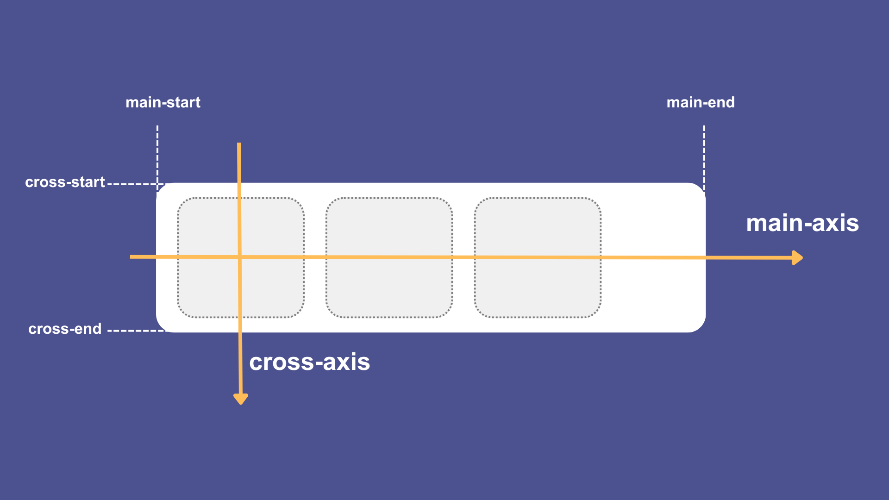
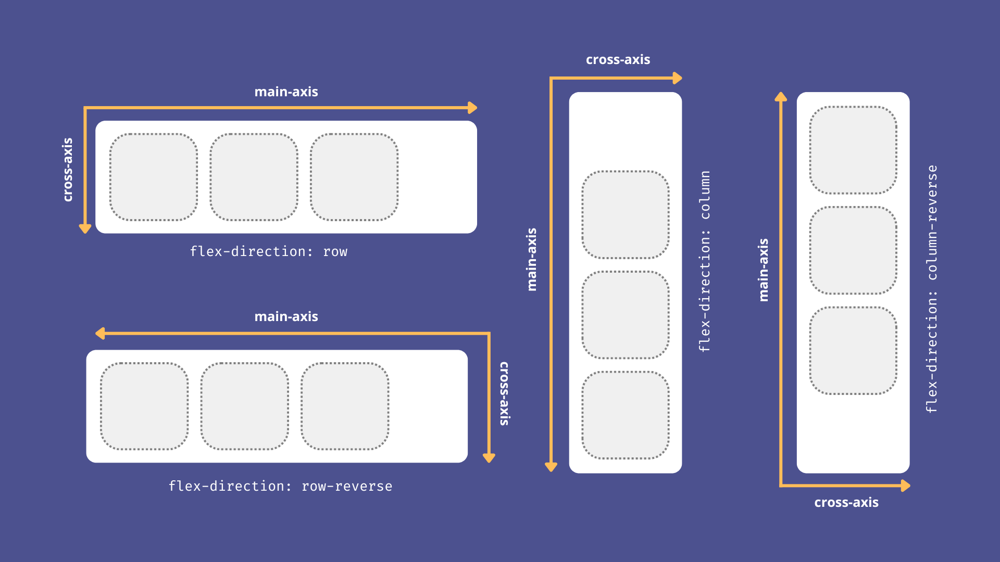
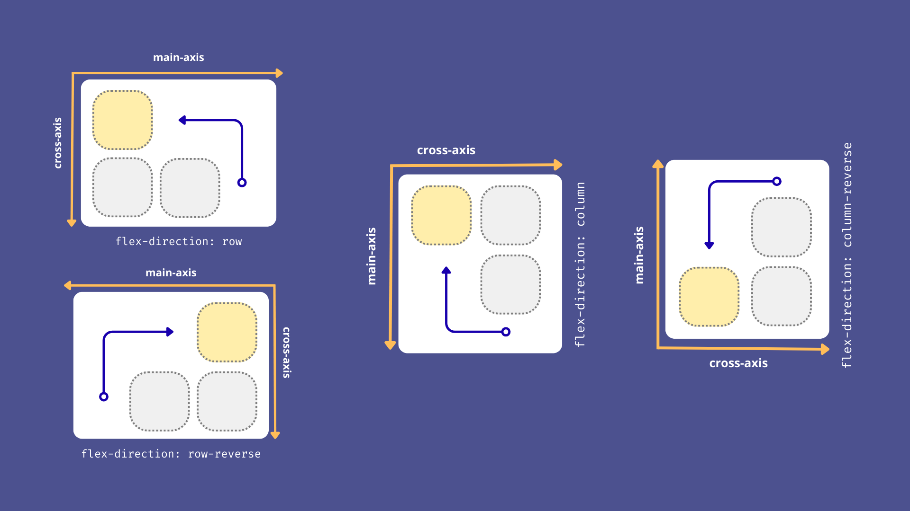
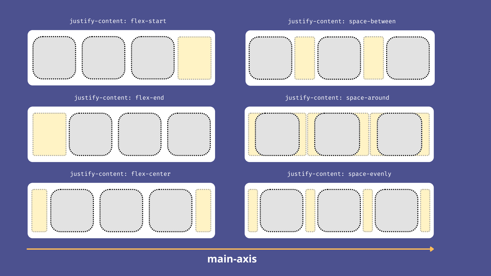
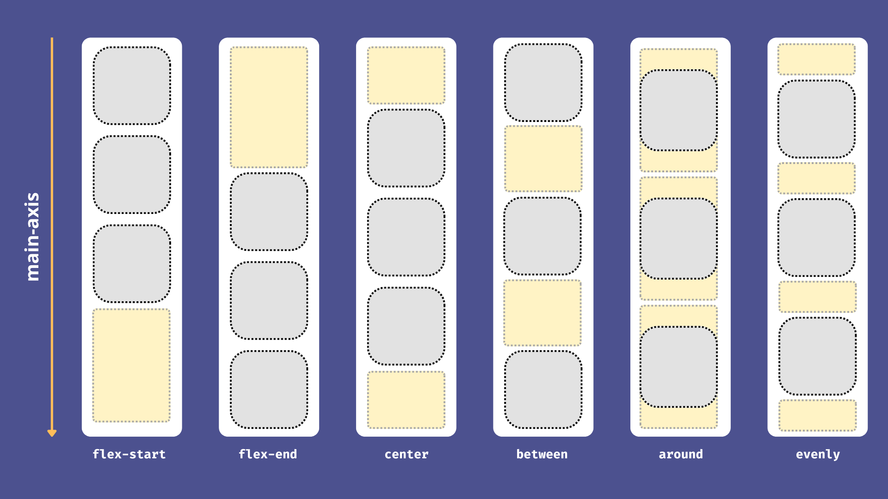
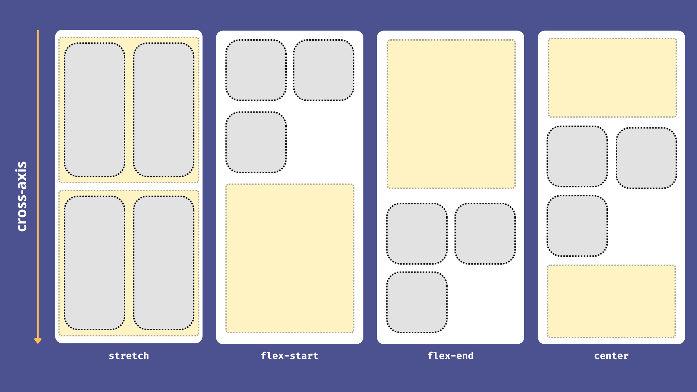
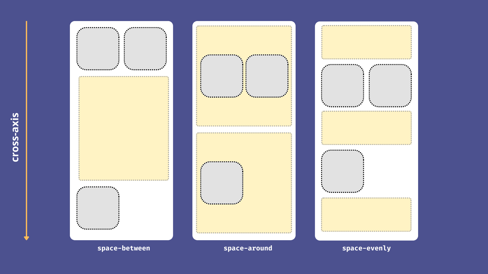
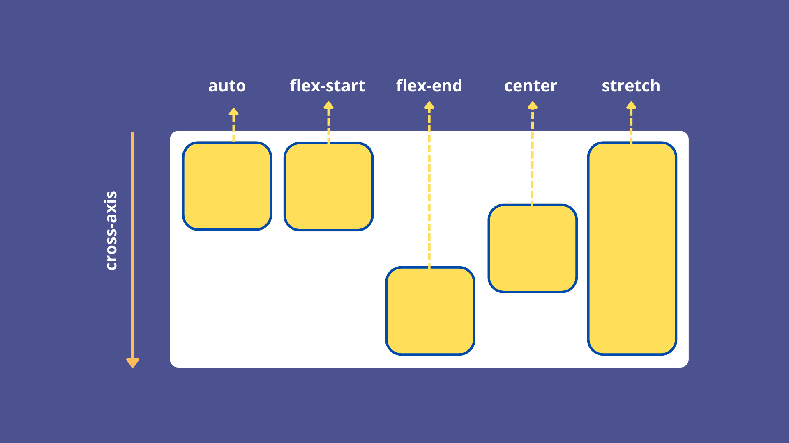

# 📘 Aula 7 - Flexbox

---

## 🔵 Introdução

O **Flexbox** (ou Flexible Box Layout) é um modelo de layout do CSS projetado para organizar e alinhar elementos dentro de um contêiner de forma mais eficiente e flexível do que os métodos tradicionais (como `float` ou `inline-block`).

Ele surgiu para resolver os problemas comuns de alinhamento e distribuição de espaço em layouts responsivos, permitindo que os elementos "se ajustem" de acordo com o espaço disponível na tela.

### 🔍 Por que usar Flexbox?

Antes do Flexbox, construir layouts complexos em CSS exigia soluções pouco práticas, como usar tabelas, `float` ou posicionamento manual. Isso trazia problemas como:

- Dificuldade em centralizar elementos verticalmente.
- Necessidade de "gambiarras" para distribuir espaçamentos.
- Falta de flexibilidade em diferentes tamanhos de tela.

O **Flexbox** foi criado para simplificar tudo isso, oferecendo:

- **Alinhamento fácil** (horizontal e vertical).
- **Distribuição inteligente** de espaço entre os elementos.
- **Layout responsivo** sem esforço extra.
- **Controle individual e em grupo** dos itens.

<div style="height: 1px"></div>

### 🔹 Conceitos principais

O Flexbox trabalha sempre com dois níveis de elementos:

**1. Contêiner Flex**

- É o elemento pai onde ativamos o flexbox com `display: flex;`.
- Ele controla como os itens filhos serão organizados.

**2. Itens Flex**

- São os elementos filhos diretos do contêiner flex.
- Cada item pode ser controlado de forma individual (crescer, encolher, alinhar).

<div style="height: 1px"></div>

### 🔹 Visão Geral das Propriedades

<table>
  <thead>
    <tr>
      <th>Categoria</th>
      <th>Propriedade</th>
      <th>Descrição</th>
    </tr>
  </thead>
  <tbody>
    <tr>
      <td rowspan="6">Contêiner</td>
      <td><code>display: flex;</code></td>
      <td>Ativa o Flexbox no elemento pai.</td>
    </tr>
    <tr>
      <td><code>flex-direction</code></td>
      <td>Define a direção dos itens (linha ou coluna).</td>
    </tr>
    <tr>
      <td><code>justify-content</code></td>
      <td>Alinha os itens no eixo principal.</td>
    </tr>
    <tr>
      <td><code>align-items</code></td>
      <td>Alinha os itens no eixo cruzado.</td>
    </tr>
    <tr>
      <td><code>flex-wrap</code></td>
      <td>Controla se os itens quebram para a próxima linha.</td>
    </tr>
    <tr>
      <td><code>align-content</code></td>
      <td>Alinha todas as linhas/colunas juntas dentro do container no cross axis</td>
    </tr>
    <tr>
      <td rowspan="4">Itens</td>
      <td><code>flex-grow</code></td>
      <td>Define se o item pode crescer.</td>
    </tr>
    <tr>
      <td><code>flex-shrink</code></td>
      <td>Define se o item pode encolher.</td>
    </tr>
    <tr>
      <td><code>flex-basis</code></td>
      <td>Define o tamanho inicial do item.</td>
    </tr>
    <tr>
      <td><code>align-self</code></td>
      <td>Permite alinhar um item individualmente, sobrescrevendo o pai.</td>
    </tr>
  </tbody>
</table>

---

## 🔵 Direções e Eixos

O **Flexbox** organiza os elementos dentro de um contêiner a partir de **dois eixos principais**:

**1. Eixo principal (main axis)**

- É a direção em que os itens são dispostos.
- Depende diretamente da propriedade `flex-direction`.
- Pode ser horizontal (linha) ou vertical (coluna).

**2. Eixo cruzado (cross axis)**

- É perpendicular ao eixo principal.
- Serve para alinhar os itens na direção contrária ao fluxo principal.

<div style="height: 1px"></div>

### 🔹 A propriedade `flex-direction`

Define a **direção do eixo principal** e, consequentemente, como os itens são organizados dentro do contêiner.

| Valor            | Descrição                                                | Fluxo                                   |
| ---------------- | -------------------------------------------------------- | --------------------------------------- |
| `row` (padrão)   | Os itens ficam em linha, da esquerda para a direita.     | Eixo principal = horizontal             |
| `row-reverse`    | Os itens ficam em linha, mas da direita para a esquerda. | Eixo principal = horizontal (invertido) |
| `column`         | Os itens ficam em coluna, de cima para baixo.            | Eixo principal = vertical               |
| `column-reverse` | Os itens ficam em coluna, mas de baixo para cima.        | Eixo principal = vertical (invertido)   |

<div style="height: 20px"></div>



**1. Main Axis (Eixo Principal)**

- Quando usamos `flex-direction: row`, o **main axis** (eixo principal) é **horizontal**, indo da **esquerda para a direita**.
- O início dele é chamado **main-start** (na esquerda) e o final é chamado **main-end** (na direita).

**2. Cross Axis (Eixo Cruzado)**

- O **cross axis** (eixo cruzado) é **vertical**, indo de **cima para baixo**.
- O início é chamado **cross-start** (no topo) e o final é o **cross-end** (embaixo).

<div style="height: 1px"></div>

### 🔹 Eixos para todos os valores de `flex-direction`



---

## 🔵 Empacotamento de Itens

Por padrão, o Flexbox tenta **colocar todos os itens em uma única linha/coluna**, dependendo do `flex-direction`, ajustando o tamanho deles se necessário. Isso funciona bem em muitos casos, mas pode causar problemas de **quebra ou sobreposição** quando temos muitos itens ou quando o container é menor do que o espaço necessário.
A propriedade `flex-wrap` controla se os itens devem **ficar em uma única linha/coluna** ou se podem **“quebrar” para linhas/colunas adicionais**. É importante ressaltar que essa "quebra" sempre será feita na direção do **cross-axis**.

<div style="height: 1px"></div>

| Valor         | Descrição                                                                                                    |
|---------------|--------------------------------------------------------------------------------------------------------------|
| `nowrap` (padrão)   |  Todos os itens ficam em uma única linha/coluna, mesmo que ultrapassem a largura/altura do container. Pode causar **overflow horizontal/vertical**. |
| `wrap`      | Os itens “quebram” na direção do **cross-axis**. |
| `wrap-reverse` | Igual ao `wrap`, mas a quebra acontece na direção **oposta do cross-axis**. |

<div style="height: 10px"></div>

**`flex-wrap: wrap`:**


<div style="height: 1px"></div>

<div style="height: 10px"></div>

**`flex-wrap: wrap-reverse`:**



<div style="height: 1px"></div>

### 🔹 A propriedade `flex-flow`

A propriedade `flex-flow` é um **shorthand** (atalho) que combina duas propriedades fundamentais do Flexbox:

- `flex-direction` → define a direção do eixo principal (**main-axis**)

- `flex-wrap` → define se os itens ficam em **uma única linha/coluna** ou se podem **quebrar** para a próxima linha/coluna.

Em vez de declarar as duas propriedades separadamente, você pode usar o `flex-flow` em uma única linha, tornando o código mais limpo e fácil de ler.

<div style="height: 10px"></div>

**Sintaxe:**
```css
flex-flow: <flex-direction> <flex-wrap>;
```

---

## 🔵 Alinhamento nos Eixos

### 🔹 `justify-content` 

Define como os itens serão distribuídos ao longo do **eixo principal** (main-axis).

<div style="height: 1px"></div>

| Valor             | Descrição                                                                                  |
|-------------------|----------------------------------------------------------------------------------------------|
| `flex-start` (padrão)     |  Os itens ficam no **início** do eixo principal (main-start).                                             |
| `flex-end`        | Os itens ficam no **final** do eixo principal (main-end).                                              |
| `center`          | Os itens ficam **centralizados** no eixo principal.                                         |
| `space-between`   | Espaço **igual entre os itens**, mas **sem espaço nas bordas** do container.                 |
| `space-around`    | Espaço **igual ao redor** de cada item. As bordas também ganham espaço (metade do interno). |
| `space-evenly`    | Espaço **totalmente uniforme** entre os itens e também nas bordas.                          |

<div style="height: 10px"></div>

**`justify-content` com `flex-direction: row`:**



<div style="height: 10px"></div>

**`justify-content` com `flex-direction: column`:**



<div style="height: 1px"></div>

### 🔹 `align-items`

Define como os itens serão alinhados no **eixo cruzado** (cross-axis), perpendicular ao eixo principal.

<div style="height: 1px"></div>

| Valor          | Descrição                                                                 |
|----------------|---------------------------------------------------------------------------|
| `stretch` (padrão)      |  Itens se esticam para ocupar todo o eixo cruzado.               |
| `flex-start`   | Alinhados ao **início** do eixo cruzado (cross-start).                                  |
| `flex-end`     | Alinhados ao **final** do eixo cruzado (cross-end).                                   |
| `center`       | Centralizados no eixo cruzado.                                            |

<div style="height: 10px"></div>

**`align-items` com `flex-direction: row`:**

<div style="height: 10px"></div>


<div style="height: 10px"></div>

**`align-items` com `flex-direction: column`:**

Para esse exemplo vamos considerar que os itens flexíveis (caixas cinzas) possuem uma largura menor que o container flexível (caixa branca).


---

## 🔵 Centralização no Flexbox

Uma das grandes vantagens do Flexbox é **centralizar elementos de forma simples**, tanto horizontalmente quanto verticalmente, sem precisar de hacks ou posicionamento manual.

**1. Centralização horizontal**

Se o eixo principal for **horizontal** (`flex-direction: row`), você pode usar `justify-content` para alinhar os itens no **main axis**:

```css
.container {
  display: flex;
  justify-content: center; /* centraliza horizontalmente */
}
```

**2. Centralização vertical**

Para alinhar os itens no **cross axis**, usamos `align-items`:

```css
.container {
  display: flex;
  align-items: center; /* centraliza verticalmente */
}
```

**3. Centralização completa**

Você pode combinar as duas propriedades para centralizar **totalmente** os elementos dentro do contêiner:

```css
.container {
  display: flex;
  justify-content: center; /* eixo principal */
  align-items: center;     /* eixo cruzado */
  height: 200px;           /* necessário para ver a centralização vertical */
}
```

O resultado é que todos os itens do container ficam **perfeitamente no centro**, tanto horizontal quanto verticalmente, sem precisar de **margens, posicionamento absoluto ou cálculos manuais**.

Essa técnica de centralização funciona com qualquer número de itens dentro do contêiner e é **responsiva**, adaptando-se automaticamente ao tamanho do container e à quantidade de elementos.

---

## 🔵 Alinhamento de Elementos Empacotados

Quando você usa `flex-wrap: wrap` para permitir que os itens se quebrem em **múltiplas linhas ou colunas**, o Flexbox oferece uma propriedade específica para alinhar essas linhas/colunas como um todo: o `align-content`. O `align-content` alinha todas as linhas/colunas juntas dentro do container no **cross axis**.

<div style="height: 10px"></div>

| Valor              | Descrição                                                           |
| ------------------ | ------------------------------------------------------------------- |
| `flex-start`       | Todas as linhas/colunas se agrupam **no início** do container (cross-start) |
| `flex-end`         | Todas as linhas/colunas se agrupam **no final** do container (cross-end)    |
| `center`           | Linhas/colunas centralizadas no cross axis                                  |
| `space-between`    | Linhas/colunas distribuídas com **espaço igual entre elas**                 |
| `space-around`     | Linhas/colunas distribuídas com **espaço igual ao redor de cada linha**     |
| `space-evenly`     | Linhas/colunas distribuídas com **espaço totalmente uniforme**              |
| `stretch` (padrão) | As linhas/colunas se **esticam para preencher** o container                 |

<div style="height: 10px"></div>

**`align-content` com `flex-direction: row`:**



<div style="height: 10px"></div>



<div style="height: 10px"></div>

---

## 🔵 Itens Flex

Assim como o container flex possui suas propriedades para organizar os filhos, cada **item dentro do flex container** também pode receber regras individuais que alteram sua posição, ordem e alinhamento.

### 🔹 `order`
Por padrão, os itens aparecem na ordem em que estão no HTML A propriedade `order` permite reordenar visualmente os elementos dentro do container, sem alterar o HTML. O valor padrão é 0. Valores menores aparecem primeiro, e valores maiores aparecem depois.

**Exemplo:**

```html
<div class="container">
  <div class="item1">A</div>
  <div class="item1">B</div>
  <div class="item1">C</div>
</div>
```

```css
.item1 {
  order: 3; /* Vai aparecer por último */
}

.item2 {
  order: 1; /* Vai aparecer antes do item1 */
}

.item3 {
  order: 2;
}
```


Mesmo que no HTML o `item1` venha antes, o CSS pode mudar a ordem visual.

<div style="height: 1px"></div>

### 🔹 `align-self`
Define o alinhamento **individual** de um item dentro do container. Funciona de forma semelhante ao `align-items`, mas aplicado em **um único item**. Pode sobrescrever o alinhamento definido no container.

<div style="height: 1px"></div>

| Valor        | Descrição                                                                  |
|--------------|----------------------------------------------------------------------------|
| `auto`       | Segue o alinhamento definido pelo container (valor padrão).                |
| `flex-start` | Alinha o item ao **início** do eixo cruzado.                               |
| `flex-end`   | Alinha o item ao **final** do eixo cruzado.                                |
| `center`     | Centraliza o item no eixo cruzado.                                         |
| `stretch`    | Estica o item para ocupar o espaço disponível no eixo cruzado.             |

<div style="height: 10px"></div>



<div style="height: 10px"></div>

### 🔹 `flex-basis`

A propriedade `flex-basis` define o **tamanho inicial principal** (main size) de um item flexível **antes da distribuição do espaço extra** ou da aplicação de `flex-grow` e `flex-shrink`. Pode ser vista como uma espécie de **largura inicial** (quando `flex-direction: row`) ou **altura inicial** (quando `flex-direction: column`). Esse valor serve como **base de cálculo**: o navegador usa o `flex-basis` como referência para saber como distribuir espaço entre os itens.

<div style="height: 1px"></div>

| Valor       | Descrição                                                                 |
|-------------|---------------------------------------------------------------------------|
| `auto`      | (padrão) O tamanho base é definido pelo conteúdo ou pelas propriedades `width`/`height`. |
| `0`         | Ignora o tamanho inicial; todo o espaço disponível será distribuído conforme o `flex-grow`. |
| `<tamanho>` | Define um tamanho inicial fixo (ex.: `200px`, `50%`, `10rem`).             |

<div style="height: 10px"></div>

**Importante:** Usar `width` ou `height` define um tamanho **fixo**, que não se adapta automaticamente ao espaço disponível. Já o `flex-basis` estabelece um **tamanho inicial preferencial** para o item dentro do eixo principal. Esse valor pode ser ajustado pelo navegador conforme o espaço total do contêiner e as regras de `flex-grow` e `flex-shrink`, garantindo mais flexibilidade e adaptação em layouts responsivos.

<div style="height: 10px"></div>

Quando trabalhamos com Flexbox, os itens podem **crescer** ou **encolher** dependendo do espaço disponível no contêiner. É aqui que entram as propriedades:

### 🔹 `flex-grow`

Define se o item pode **crescer** quando houver **espaço extra** no contêiner. O valor é proporcional:

<div style="height: 1px"></div>

| Valor | Descrição                                                                 |
|-------|---------------------------------------------------------------------------|
| `0`   | (padrão) O item **não cresce** além do seu tamanho inicial.               |
| `1`   | O item **cresce proporcionalmente** ao espaço disponível.                 |
| `2+`  | Quanto maior o valor, **mais espaço extra** o item ocupa em relação aos outros. |

<div style="height: 10px"></div>

### 🔹 `flex-shrink`

Define se o item pode **encolher** quando **faltar espaço** no contêiner. Também funciona de forma proporcional:

<div style="height: 1px"></div>


| Valor | Descrição                                                                 |
|-------|---------------------------------------------------------------------------|
| `0`   | O item **não encolhe**, mesmo que o container fique menor que o conteúdo. |
| `1`   | (padrão) O item **encolhe proporcionalmente** em relação aos outros.      |
| `2+`  | Quanto maior o valor, **mais o item reduz** seu tamanho em comparação aos demais. |

<div style="height: 10px"></div>

### 🔹 `flex`

A propriedade `flex` é um **shorthand** que combina três propriedades:

- `flex-grow` → define a capacidade de crescer.
- `flex-shrink` → define a capacidade de encolher.
- `flex-basis` → define o tamanho inicial preferencial.

**Sintaxe geral:**
```css
flex: <flex-grow> <flex-shrink> <flex-basis>;
```


- Todos os valores são opcionais, mas a ordem **sempre é essa**.

- Caso não seja definido algum valor, o navegador usa **valores padrão**:

  - `flex-grow: 0`
  - `flex-shrink: 1`
  - `flex-basis: auto`

<div style="height: 10px"></div>


**Valors comuns:**
| Valor             | O que significa                                                                                                                                                                                              |
| ----------------- | ------------------------------------------------------------------------------------------------------------------------------------------------------------------------------------------------------------ |
| `flex: initial`         | Não cresce (`flex-grow: 0`), encolhe se faltar (`flex-shrink: 1`) e tamanho inicial baseado no conteúdo (`flex-basis: auto`).|
| `flex: auto`      | Cresce se houver espaço (`flex-grow: 1`), encolhe se faltar (`flex-shrink: 1`) e tamanho inicial baseado no conteúdo (`flex-basis: auto`).                                           |
| `flex: none`      | O item **não cresce nem encolhe** (`flex-grow: 0`, `flex-shrink: 0`) e mantém o tamanho inicial (`flex-basis: auto`).                                                                                        |
| `flex: 3` | Define: `flex-grow: 3`. `flex-shrink`  e `flex-basis` assumem o valor padrão                                        |


---